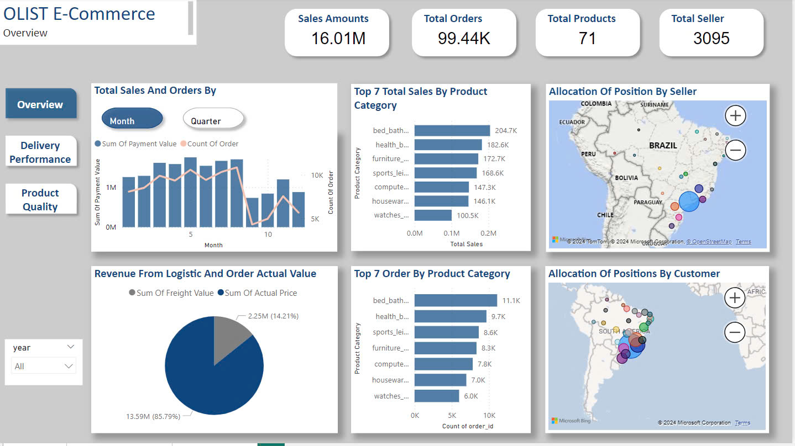
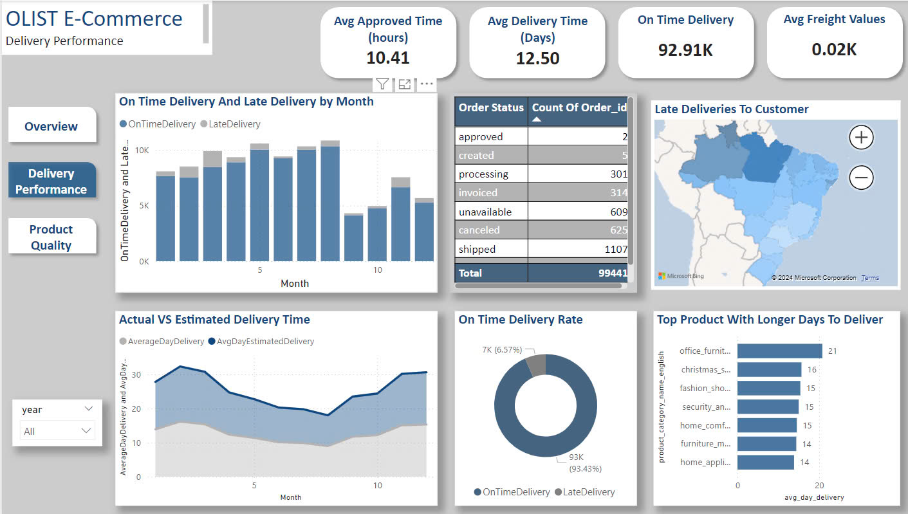
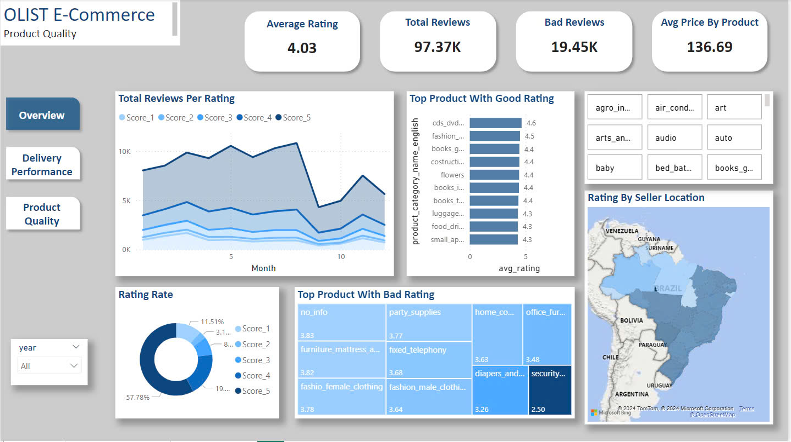

# Olist Data Analysis Project

## Project Overview
This project focuses on analyzing data from Olist, an online marketplace platform, to uncover business insights and trends. The analysis utilizes SQL for data processing and Power BI for visualization. The insights address key business questions, helping Olist optimize operations and improve performance.

---

## Key Business Questions Answered

### 1. **Total Revenue and Its Trend Over Time**
   - **Objective:** Calculate the total revenue generated by Olist and examine its changes over time.
   - **Insights Provided:**
     - Total revenue.
     - Monthly and yearly revenue trends.

### 2. **Number of Orders and Seasonal Trends**
   - **Objective:** Determine the total number of orders placed and analyze monthly or seasonal trends.
   - **Insights Provided:**
     - Total orders across the platform.
     - Seasonality patterns.

### 3. **Popular Product Categories and Sales Comparison**
   - **Objective:** Identify the most popular product categories and compare their sales performance.
   - **Insights Provided:**
     - Top-performing categories.
     - Sales comparison across categories.

### 4. **Average Order Value (AOV)**
   - **Objective:** Compute the average order value and analyze its variation by product category and payment method.
   - **Insights Provided:**
     - AOV across the platform.
     - Impact of product categories and payment methods on AOV.

### 5. **Number of Active Sellers and Trends**
   - **Objective:** Determine the number of active sellers and analyze how this has changed over time.
   - **Insights Provided:**
     - Growth trends in seller activity.
     - Seasonal or market-driven fluctuations.

### 6. **Seller Ratings and Impact on Sales**
   - **Objective:** Examine the distribution of seller ratings and their effect on sales performance.
   - **Insights Provided:**
     - Correlation between seller ratings and sales volume.
     - Distribution of seller ratings.

### 7. **Repeat Customers and Contribution to Revenue**
   - **Objective:** Calculate the number of repeat customers and their contribution to total revenue.
   - **Insights Provided:**
     - Percentage of repeat customers.
     - Revenue share from repeat customers.

### 8. **Customer Ratings and Impact on Sales**
   - **Objective:** Determine the average customer rating for products and its effect on sales performance.
   - **Insights Provided:**
     - Correlation between customer ratings and sales.
     - Product performance trends based on ratings.

### 9. **Order Cancellation Rate**
   - **Objective:** Calculate the average order cancellation rate and its effect on seller performance.
   - **Insights Provided:**
     - Average cancellation rate.
     - Impact on overall operational efficiency.

### 10. **Best-Selling Products and Trends Over Time**
   - **Objective:** Identify top-selling products and analyze how their sales trends have evolved over time.
   - **Insights Provided:**
     - Best-selling products.
     - Seasonal or market trends affecting product performance.

### 11. **Impact of Customer Reviews on Sales**
   - **Objective:** Analyze how customer reviews and ratings affect sales and product performance.
   - **Insights Provided:**
     - Correlation between review quality and sales.
     - Performance metrics for high-rated products.

### 12. **Profit Margins by Product Category**
   - **Objective:** Identify product categories with the highest profit margins and strategies to increase profitability in other categories.
   - **Insights Provided:**
     - Top profit-generating categories.
     - Recommendations for margin improvement.

### 13. **Customer Demographics and Retention by Location**
   - **Objective:** Map high-density customer regions and calculate retention rates by location.
   - **Insights Provided:**
     - Customer hotspots.
     - Retention rates and potential geographic targeting strategies.

---

## Tools and Technologies
- **SQL:** Data extraction, transformation, and analysis.
- **Power BI:** Interactive data visualization and dashboard creation.
- **Datasets:** [link dataset](https://www.kaggle.com/datasets/olistbr/brazilian-ecommerce)

---

## Dashboard Highlights
- **Overview:**
  - Provides a snapshot of total revenue, order trends, and popular product categories.
- **Delivery Performance:**
  - Analyzes order cancellation rates, average delivery time, and their impacts on delivery efficiency.
- **Product Quality:**
  - Evaluates customer ratings and reviews, highlighting their influence on sales and product performance.

---
